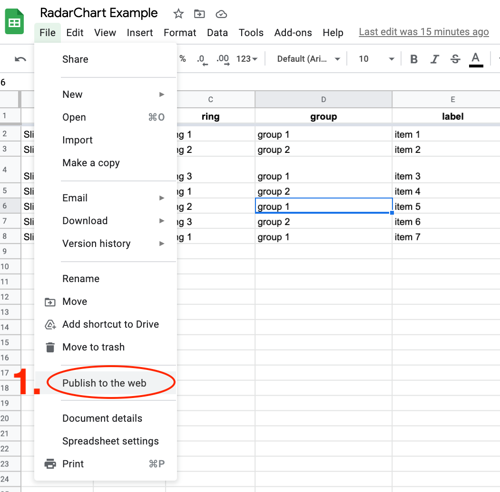
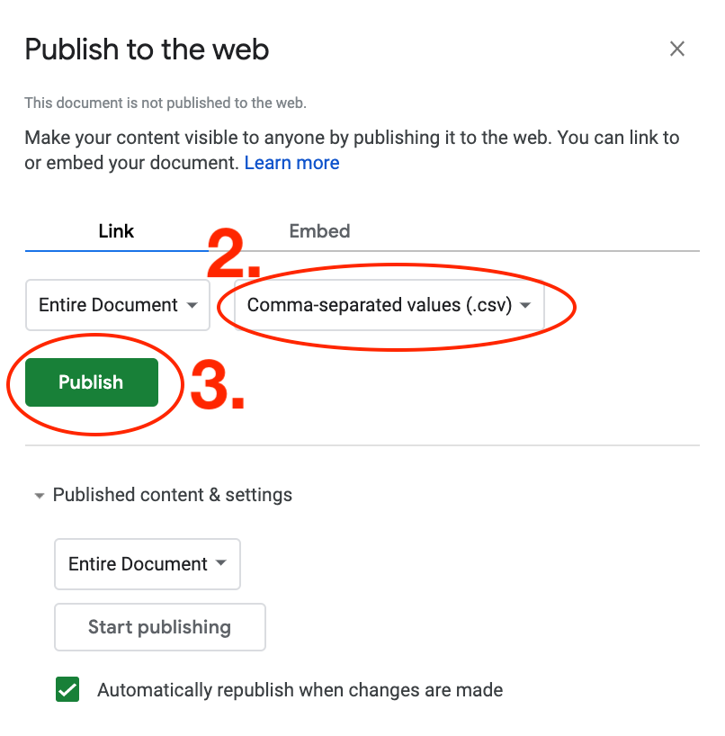
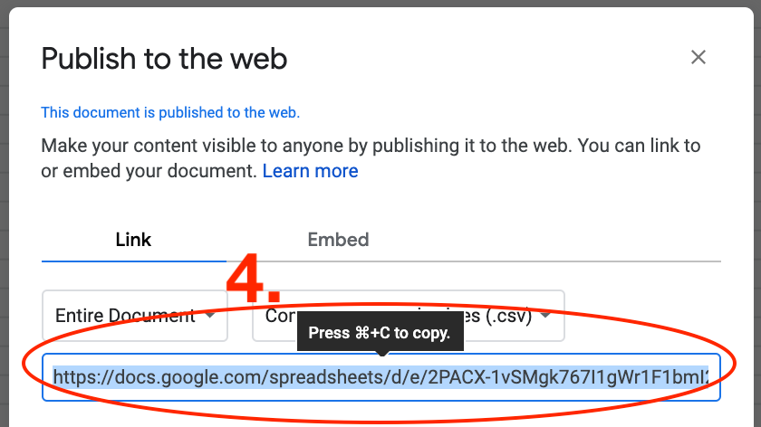
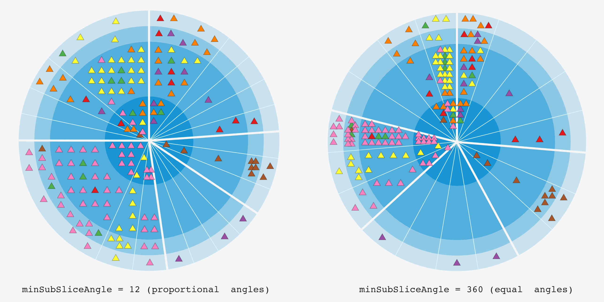
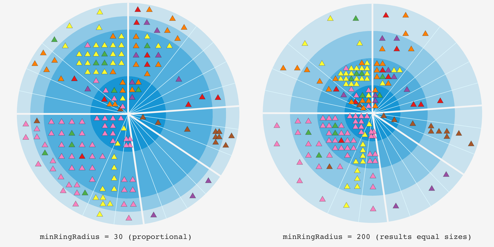

# RadarChart

A radar chart to generate an overview of your roadmap or tech radar.

[Live demo](https://radarchart.netlify.app/?ex=2)


- Arranges your items (e.g. initiatives) on a Pie view:
  - high level grouping (e.g. goals) => slices
  - optional sub grouping (eg. outcomes) => subSlices
  - your timescale/ring classification (eg. Now/Next/Later, Q1/Q2/Q3/Q4, adopt/trial/asses/hold etc.) => rings
- Generates tooltips for each item
- Reads data from CSV, Google sheet (via CSV publish) or JSON. _Get in touch if you need a different source for your use case (eg. Trello, Jira etc.)_
- Customizable:
  - colors, fonts etc. via [style.css](src/style.css)
  - layout and item markers via RadarConfig. See examples below and in [index.ts](src/index.ts)

## Examples

### Tech radar

ThoughtWorks Technology Radar vol 23 - notice that sub-slices are optional.

[Live view](https://radarchart.netlify.app/?ex=4)


ThoughtWorks' [original tech radar](https://www.thoughtworks.com/radar) layout is better for this use case but
less generic (e.g fixed 4 slices and 4 rings, no sub-slices etc.).

## Using it with your data

The simplest way to add data is via a google spreadsheet:

1.  Save a copy of [this spreadsheet](https://docs.google.com/spreadsheets/d/1gqbrntkGRWvXSzqCt-LjLCQyHzp8-vsI4BauvBBtHIE/)

    _Note_: sheet columns (watch out for the capitalization):

    slice, [subSlice], ring, group, label, [description]

1.  Add your items one per row

    _Tips:_

    - rings will be displayed in the order of appearance in the sheet. I.e. the ring of the first item in the spreadsheet will be the innermost ring.
    - subSlice is optional , you can have single level grouping
    - The order of slices and sub slices are conserved.
    - Item colours are based on their group. Colors are assigned to [d3.schemeSet1](https://github.com/d3/d3-scale-chromatic#schemeSet1) color scheme in the order of their appearance. I.e. first group appearing will be red by default. You can customize the colorscheme. See an example in [Example.ts](src/Example.ts)

1.  Publish the sheet as CSV and copy the link

    
    
    

1.  Add the link as `csv` url parameter

    `https://radarchart.netlify.app/?csv=<your link>`

    It should look something like this:

    [https://radarchart.netlify.app/?csv=https://docs.google.com/spreadsheets/d/e/2PACX-1vSMgk767I1gWr1F1bmI2XMttvPa1TyXcdd910BSfQZjqIvOHA_aE_ESnAhftTmjnJ-KL5uwPr-LIRYJ/pub?output=csv](https://radarchart.netlify.app/?csv=https://docs.google.com/spreadsheets/d/e/2PACX-1vSMgk767I1gWr1F1bmI2XMttvPa1TyXcdd910BSfQZjqIvOHA_aE_ESnAhftTmjnJ-KL5uwPr-LIRYJ/pub?output=csv)

    Note: Radar Chart will reflect changes in your google sheet after reload. Published google sheets take sometime to reflect the changes just be patient and keep reloading.

## Customizing

- colors, fonts etc. via [style.css](src/style.css)
- layout and item markers via RadarConfig. See examples in [index.ts](src/index.ts)

### Tooltips


Tooltip layout is configurable in [style.css](src/style.css)

### Sub-slice sizing: equal vs. proportional

Sub-slices are sized equally by default so it's apparent when some sub-slices have much less items than others.

If you have too many items in some sub slices compered to other sub-slices then you might want to allow proportional sub slice sizing with `radarConfig.pie.minSubSliceAngle`


### Ring sizing: equal vs. proportional

Rings are sized proportional to the number of items in each ring by default. You can adjust the minimum ring radius with `radarConfig.pie.minRingRadius`

If you want the rings to have equal sizes then set `minRingRadius` to a number which is higher than the total radius.



## Usage in your code

For more details (eg. `RadarConfig` tips, error handling etc.) see [index.ts](src/index.ts)

```ts
import "./style.css";
import * as d3 from "d3";

const svg = d3
  .select("#myRadar-div")
  .append("svg")
  .classed("radar-svg-container", true)
  .attr("viewBox", `0 0 900 500`);

//////////////////////////////////////////////////////////////////////////
// Setup data source. You can pass an external URL of a CSV file as well
const radarDs = new SingleDsvDataSource("./exampleData/TW_TechRadar_Vol23.csv");

//////////////////////////////////////////////////////////////////////////
// Creating the chart with default configs.
//      Customize it by passing a RadarConfig object
const radarContainer = new RadarContainer();

//////////////////////////////////////////////////////////////////////////
// Fetch data and append it to svg
radarContainer.fetchData(radarDs).then(() => {
  radarContainer.appendTo(svg);
});
```

_Note: an npm module is coming..._

## Licence

This project is licensed under the GNU Affero General Public License v3.0 license - see the [LICENSE](LICENSE) file for details.
