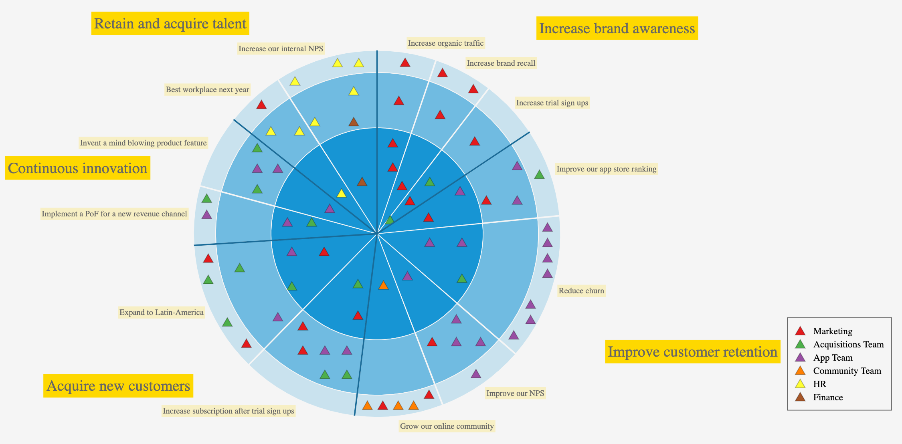
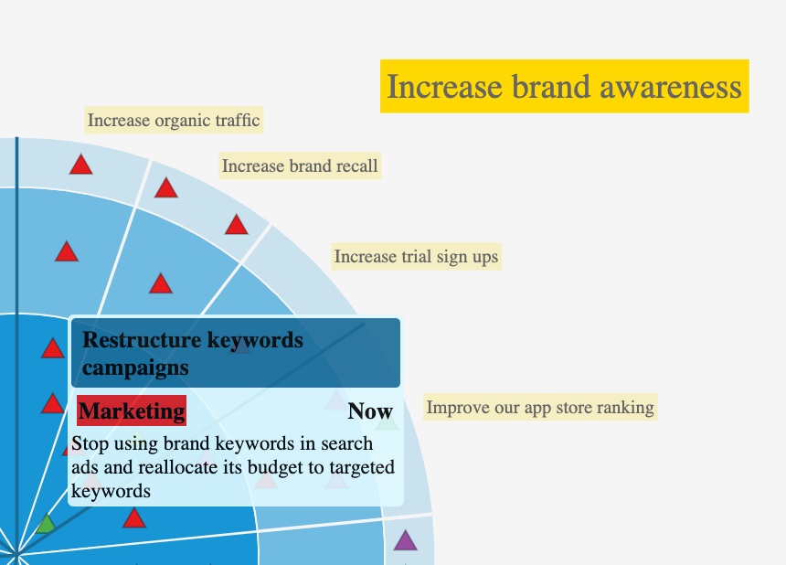
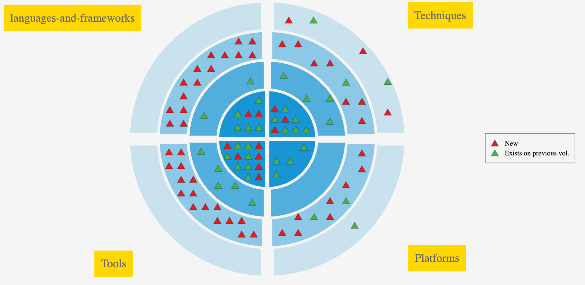

# RadarChart

A radar chart to generate an overview of your roadmap or tech radar.

[Live demo](https://radarchart.netlify.app/?ex=2)



- Arranges your items (e.g. initatives or any item) on a Pie view:
  - high level grouping (e.g. your goals or any main category) => slices
  - optional sub grouping (eg. your outcomes) => subslices
  - your timescale/ring classification (eg. Now/Next/Later, Q1/Q2/Q3/Q4, adopt/trial/asses/hold etc.) => rings
- Generates tooltips for each item
- Reads data from CSV or JSON. Get in touch if you need a different source for your use case (eg. Trello, Google Spreadsheet, Jira etc.)
- Highly customizable:
  - colors, fonts etc. via [style.css](src/stlye.css)
  - layout and item markers via RadarConfig. See examples below and in [index.ts](src/index.ts)

## More Examples

### Tooltips



Tooltip layout is configurable in [style.css](src/stlye.css)

### Tech radar

ThougthWorks Technology Radar vol 23

[Live view](https://radarchart.netlify.app/?ex=4)



ThoughtWorks' [original tech radar](https://www.thoughtworks.com/radar) layout is nicer but less generic (e.g fixed 4 slices and 4 rings, no sub-slices etc.).

## Usage in your code

For more details (eg. `RadarConfig` tips, error handling etc.) see [index.ts](src/index.ts)

```ts
import "./style.css";
import * as d3 from "d3";
import { DataImportError, InputDataValidationErrors } from "./Errors";

const svg = d3
  .select("#myradar-div")
  .append("svg")
  .classed("radar-svg-container", true)
  .attr("viewBox", `0 0 900 500`);

//////////////////////////////////////////////////////////////////////////
// Setup datasource - replace with your own
const radarDs = new SingleDsvDataSource("./exampleData/TW_TechRadar_Vol23.csv");

//////////////////////////////////////////////////////////////////////////
// Creating the chart with defualt configs.
//      Customize it by passing a RadarConfig object
const radarContainer = new RadarContainer();

//////////////////////////////////////////////////////////////////////////
// Fetch data and append it to svg
radarContainer.fetchData(radarDs).then(() => {
  radarContainer.appendTo(svg);
});
```

## Licence

This project is licensed under the GNU Affero General Public License v3.0 license - see the [LICENSE](LICENSE) file for details.
